# DIOToken ERC20 Solidity Token

This repository is part of the lab activity "Criando o Seu Primeiro Token do Zero nos Padrões Web3" of the Binance DIO course and includes two versions of the DIOToken smart contract, implementing the ERC20 token standard using Solidity. These contracts are configured for different Solidity compiler versions and provide essential methods for token management and interaction. Deployment and testing are facilitated using Remix IDE, MetaMask, and the Sepolia TestNet.

## Table of Contents

1. [Project Description](#project-description)
2. [Technologies Utilized](#technologies-utilized)
3. [Getting Started](#getting-started)
4. [Installation and Configuration](#installation-and-configuration)
5. [Usage](#usage)
6. [Methods and Events](#methods-and-events)
7. [Project Proof and Documentation](#project-proof-and-documentation)

## Project Description

DIOToken is a simple implementation of the ERC20 Token Standard, allowing users to mint, transfer, and manage tokens. The token is configured with basic functionalities like transfer, approval, and allowance. The integration of SafeMath ensures safe arithmetic operations within transactions.

## Technologies Utilized

- **Solidity v0.4.24 / v0.8.7** for smart contract coding.
- **Remix IDE** for contract development, testing, and deployment.
- **MetaMask** for managing accounts and submitting transactions.
- **Sepolia TestNet** as the testing environment, allowing the execution and validation of smart contract functionality.

## Getting Started

To begin interacting with the DIOToken smart contracts, you will require a development environment set up with the appropriate tools and accounts configured on the Sepolia TestNet.

## Installation and Configuration

### Prerequisites

- **MetaMask** setup on your browser, connected to the Sepolia TestNet.
- **Remix IDE** available via browser at [Remix Ethereum](https://remix.ethereum.org).

### Steps

1. **Load the Contract in Remix**:
   - Open Remix IDE and create a new file for each version of the contract provided in the repository. Copy the Solidity code into these files.

2. **Select the Compiler**:
   - Choose the appropriate Solidity compiler version in Remix (either 0.4.24 or 0.8.7).

3. **Compile the Contracts**:
   - Compile both files to check for any syntax errors or warnings.

4. **Deploy to Sepolia TestNet**:
   - Connect MetaMask to the Sepolia TestNet.
   - Use Remix to deploy the contracts on Sepolia by selecting "Injected Web3" as the environment in the "Deploy & Run" module.

## Usage
Use the deployed contract on Sepolia TestNet to conduct transactions using MetaMask for Ether management:

1. **Access the Contract**: 
   - Interact with the deployed contract within the Remix interface. Input values and call the respective functions like `transfer`, `approve`, etc.

2. **Managing Transactions**:
   - Monitor transactions through MetaMask; ensure you have enough test Ether to cover gas fees which can be requested from Sepolia faucets.

## Methods and Events

### ERC20 Token Methods

- **`totalSupply()`**: Retrieves the token's total supply.
- **`balanceOf(address tokenOwner)`**: Checks balance of an address.
- **`allowance(address tokenOwner, address spender)`**: Retrieves allowed spending balance.
- **`transfer(address to, uint tokens)`**: Executes token transfers.
- **`approve(address spender, uint tokens)`**: Approves spending allowances.
- **`transferFrom(address from, address to, uint tokens)`**: Transfers tokens if allowed.

### Key Events

- **`Transfer(address indexed from, address indexed to, uint tokens)`**: Emits when tokens are transferred.
- **`Approval(address indexed tokenOwner, address indexed spender, uint tokens)`**: Emits when a spending allowance is granted.

To successfully utilize this token contract, follow the detailed instructions to compile, deploy, and test the functionalities within a controlled environment like Sepolia using Remix IDE and MetaMask.

## Project Proof and Documentation

This section showcases images as proof of the successful creation, deployment, and interaction with the DIOToken smart contracts on the Sepolia TestNet using Remix IDE and MetaMask.

1. **Metamask: Initial**:
   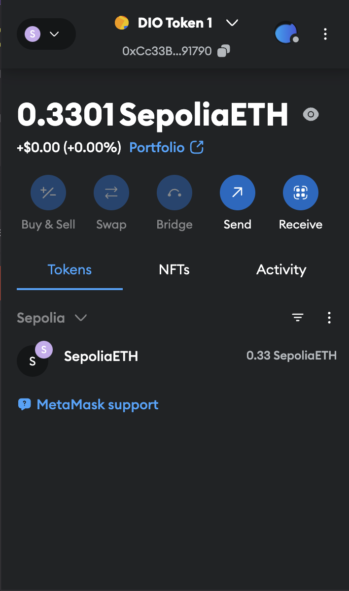

2. **Remix: Contract Deployed**:
   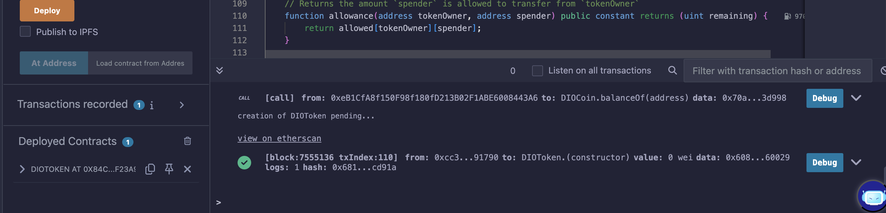

3. **Metamask: Contract Pending**:
   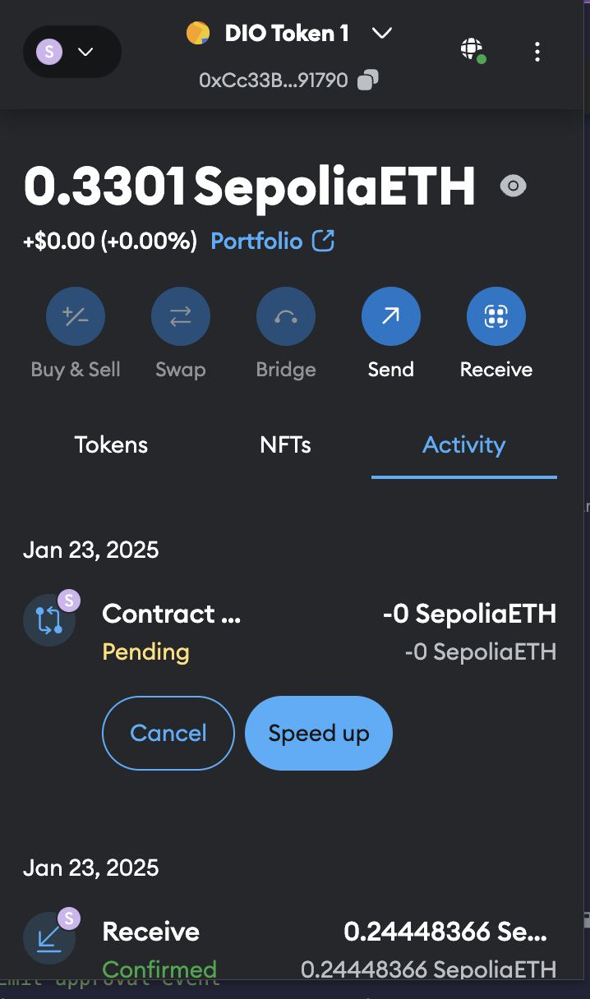

4. **Metamask: Contract Confirmed and Details**:
   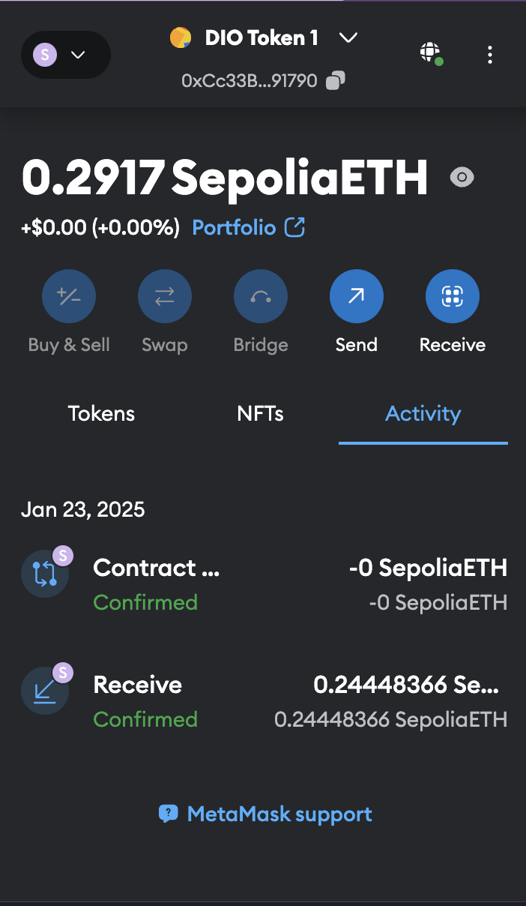
   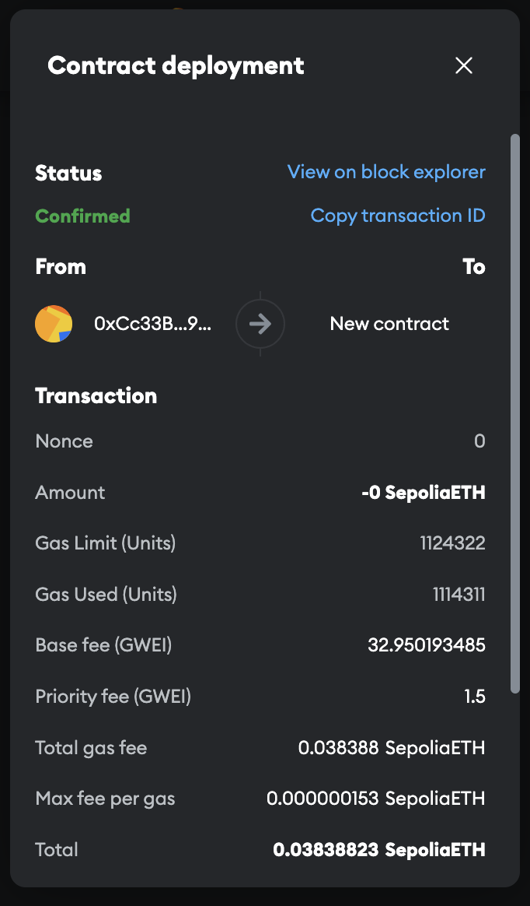
   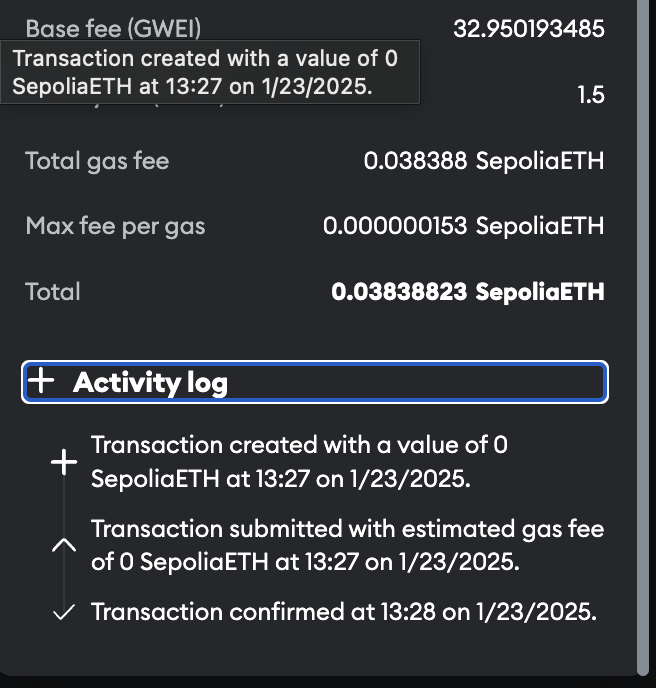

5. **Etherscan: Transaction Details**:
   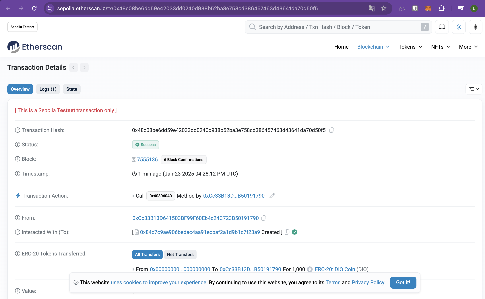
   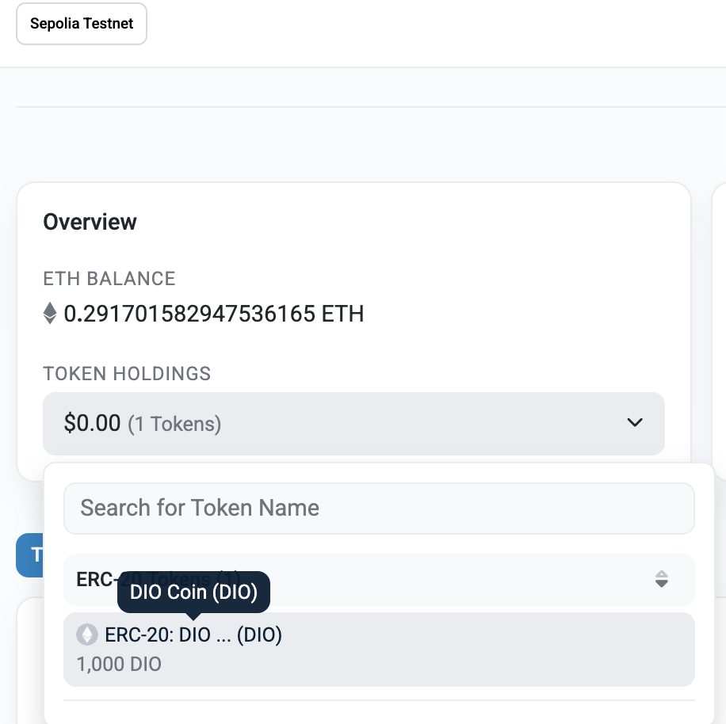
   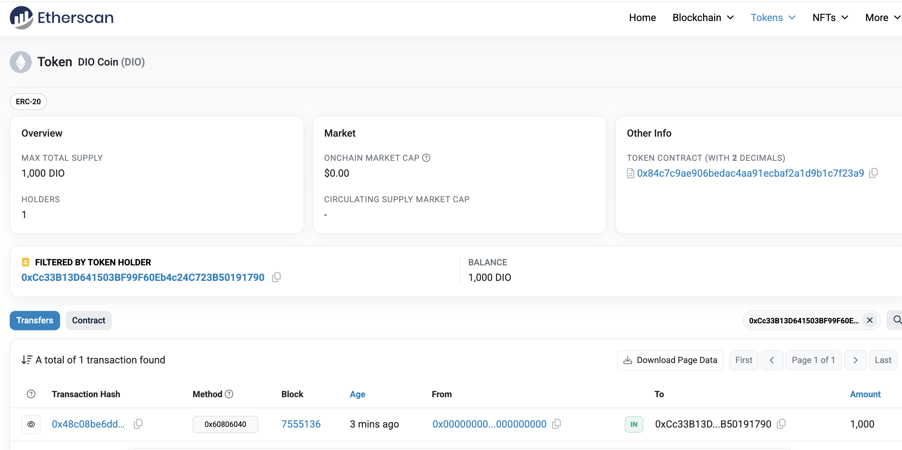

6. **Metamask: Token Imported Manually**:
   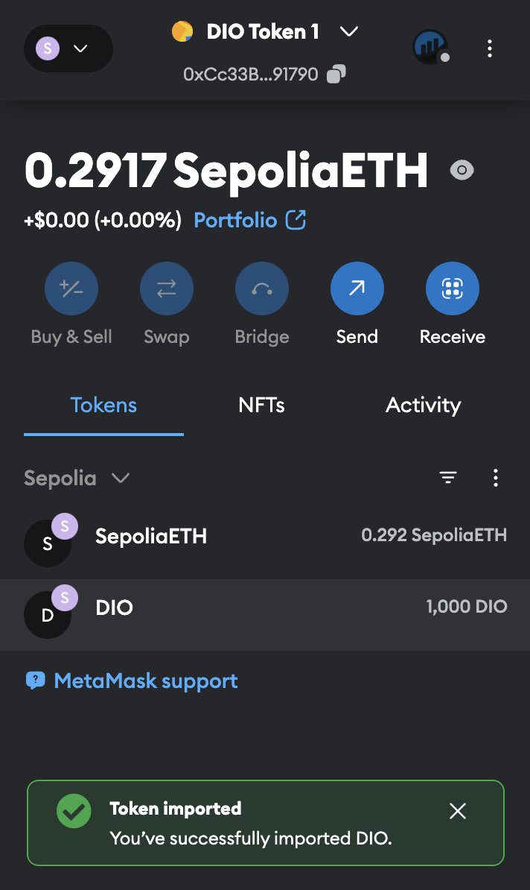

7. **Metamask: Token Balance**:
   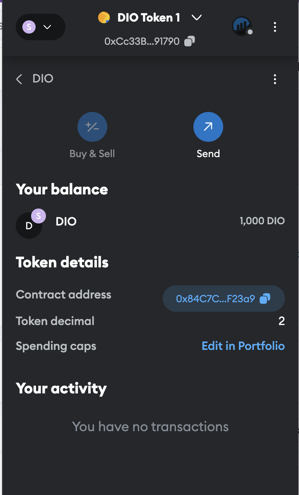

